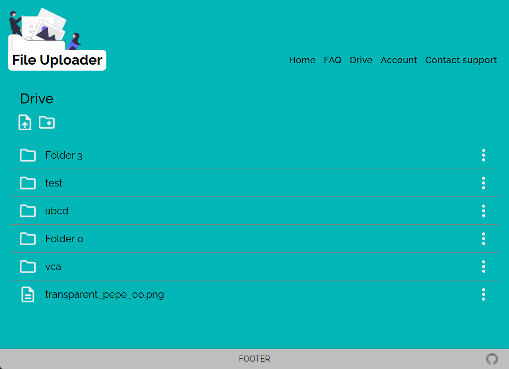

<!-- Improved compatibility of back to top link: See: https://github.com/othneildrew/Best-README-Template/pull/73 -->

<a name="readme-top"></a>

<!--
*** Thanks for checking out the Best-README-Template. If you have a suggestion
*** that would make this better, please fork the repo and create a pull request
*** or simply open an issue with the tag "enhancement".
*** Don't forget to give the project a star!
*** Thanks again! Now go create something AMAZING! :D
-->

<!-- PROJECT SHIELDS -->
<!--
*** I'm using markdown "reference style" links for readability.
*** Reference links are enclosed in brackets [ ] instead of parentheses ( ).
*** See the bottom of this document for the declaration of the reference variables
*** for contributors-url, forks-url, etc. This is an optional, concise syntax you may use.
*** https://www.markdownguide.org/basic-syntax/#reference-style-links
-->
<!-- [![Contributors][contributors-shield]][contributors-url] -->
<!-- [![Forks][forks-shield]][forks-url]
[![Stargazers][stars-shield]][stars-url]
[![Issues][issues-shield]][issues-url]
[![MIT License][license-shield]][license-url]
[![LinkedIn][linkedin-shield]][linkedin-url] -->

<!-- PROJECT LOGO -->
<br />
<div align="center">
  <a href="https://github.com/mikeyCos/file-uploader">
    
  </a>

<h3 align="center">ProjectName</h3>

  <p align="center">
    Simple personal storage application.
    <br />
    <!-- <a href="https://github.com/github_username/repo_name"><strong>Explore the docs »</strong></a>
    <br /> -->
    <br />
    <a href="https://file-uploader-mikey-cos.fly.dev/">Live Preview</a>
    ·
    <a href="https://github.com/mikeyCos/file-uploader/blob/main/PROJECT_SPECIFICATIONS.md">Project Specifications</a>
    <!-- ·
    <a href="https://github.com/github_username/repo_name/issues/new?labels=bug&template=bug-report---.md">Report Bug</a>
    ·
    <a href="https://github.com/github_username/repo_name/issues/new?labels=enhancement&template=feature-request---.md">Request Feature</a> -->
    ·
    <a href="https://github.com/mikeyCos/file-uploader/blob/main/CHANGELOG.md">Changelog</a>
  </p>
</div>

<!-- TABLE OF CONTENTS -->
<details>
  <summary>Table of Contents</summary>
  <ol>
    <li>
      <a href="#about-the-project">About The Project</a>
      <ul>
        <li><a href="#built-with">Built With</a></li>
      </ul>
    </li>
    <li>
      <a href="#getting-started">Getting Started</a>
      <ul>
        <li><a href="#prerequisites">Prerequisites</a></li>
        <li><a href="#installation">Installation</a></li>
      </ul>
    </li>
    <li><a href="#usage">Usage</a></li>
    <li><a href="#roadmap">Roadmap</a></li>
    <li><a href="#contributing">Contributing</a></li>
    <li><a href="#contact">Contact</a></li>
    <li><a href="#acknowledgments">Acknowledgments</a></li>
    <li><a href="#questions">Questions</a></li>
  </ol>
</details>

<!-- ABOUT THE PROJECT -->

## About The Project

<div align="center">
  <a href="https://members-only-mikey-cos.fly.dev/">
    
  </a>
</div>

Project: File Uploader

Hello world,

Building this project was quite the endeavor. I practiced utilizing Prisma, Supabase, Express, Node, PostCSS, and deploying to Fly.io. Despite wanting to add more features, I am content with the project's current state. The database is seeded with filler data for functionality purposes. There were times my frustration told me to quit and there were times my stubbornness fed into my frustration. However, resolving frustrating problems were satisfying. 

The project's main objectives involves CRUD methods(Create, Read, Update, and Delete), interact a PostgreSQL database with a Object-Relational Mapper (ORM), authentication, uploading and downloading files, and expirable routes. Users can create an account to access the drive page. On the drive page, users can create, read, update, and delete folders and/or upload files. Only the file and folder names can be updated. Users can create nested folders and those folders can have files and folders. If a user deletes a folder with folders and/or files, all subfolders and files are deleted. Users should not be able to view other users' files and folders unless their folder was shared by the account owner. Folders can be shared for up to 30 days, and will be on it's own route. Shared folders create, update and delete methods cannot be used by users who are not the folder's owner on shared folders.

In order to authenticate on specific routes instead of authenticating the entire router, I defined my routes as functions. For example, calling `shareRoutes()` from `shareRoutes.js` module will return the router. The function optionally accepts `isAuth` parameter, and `isAuth` can be use on specific routes. Therefore, `GET` request on `/share/:folderID` does not require authentication, but `PUT` request on `/share/:folderID` will require authentication. This should prevent anyone from sharing folders.

As tradition, I exceeded the project specifications. I need to stop, but I wanted to use the opportunity to practice what I have learned in the past. For example, fetching from the client and serving HTML from the server; I am unsure if this is good practice, because the client will need to parse the response. More specifically, clicking the create a new folder button will fetch the corresponding HTML, append the HTML to the dialog and open the dialog. Essentially, clicking a button that opens the dialog will fetch the component with the base URL `/components/`.

I also constructed the ability to create subfolders (nested folders) by defining a self-relation for the `Folder` model. A folder will have a `parentFolder` filed and a folder will have `subFolders` field. When a user creates a folder inside a folder, the `folderID` request parameter is used to connect that folder to the subfolder as the `parentFolder`. The `folderID` request parameter is handy to determine whether or not the newly created `subFolder` needs to inherit the parent folder's `expiresAt` field.

Now that a subfolders can be created, I needed to let the user know where are they according to the current folder. For example:
```
  Drive
  |—— Files
  |—— Folders
      |—— Cats
          |—— Tuxedo
              |—— Sleeping
          |—— Scottish Fold
      |—— Dogs
```
If the user is looking at Sleeping folder, the folder's 'path' will be `drive > Cats > Tuxedo > Sleeping`. I accomplish this with the recursive function `traverseParentFolders`. The function accepts `accountID`, `folderID`, `arr` and `cb` parameters. The `arr` is returned if `accountID` or `folderID` are null or undefined. This will recursively get the parent folder of the current folder and push `currentFolder` into the `arr`.

Since nested folders are possible and folders can be shared, then all nested folders need to inherit the 'root' folder's `expiresAt` value. A 'root' folder, the initial shared folder, has non-null value for `expiresAt`. In order to update all the nested folders I needed to recursively select the folder's subfolder. I achieve this with the recursive function `traverseSubfolders`. In this case, the `cb` parameter will be the returned value of `updateFolderExpiresAt` which updates a folder's `expiresAt` value.

When it came to CSS styling I tried out `PostCSS` originally for CSS modules, but I discovered I would either need to compile my EJS views/partials or parse a JSON object for transformed classes and use it's result as a local variable. So, I did not proceed with CSS modules, and settled with using mixins for a few selectors. I like how PostCSS bundles my stylesheets into one stylesheet and I needed declare my imports from bottom to top; bottom taking precedence.

One solution I am not pleased with is the way I handle form submission on the client, which can be found in [form_onSubmit.js module](./public/scripts/form_onSubmit.js). Making the `onSubmit` function modular was challenging because I had to keep in mind of the different forms, invalid forms, and invalid requests. There is repeated code involving parsing `res.text`. I nearly forgot rejected Promises must be handled `onRejected` in `then()` method instead of `onFullFilled`; I confused `res` as `response` with `resolve`. If the server's response is falsy, then, depending on the status code, I rejected the response. I know the module could be refactored but I cannot think of a clear solution.

Nevertheless, I am glad to put this project aside and move forward with my learning. I experienced the lows and highs with the File Uploader project. I asked myself "What if a user did XYZ? What do I want to prohibit and permit?" or "What if a user submits a form with XYZ?" What do I do?" Which lead me to take some time planning what the application should do in certain cases. For example, a user changing form `action` attribute or certain `data-*` attributes. Submitting a form with a invalid `action` attribute should not be processed into a database. I learned about how to validate files, upload files into a database, communicate to a database with Prisma, perform recursive selects, and declare mixins. I cannot wait to learn the next thing. 

To failing forward, cheers!

<p align="right">(<a href="#readme-top">back to top</a>)</p>

### Built With

[![JavaScript][JavaScript.js]][JavaScript-url]
[![Node][NodeJS]][NodeJS-url]
[![Express][Express.js]][Express-url]
[![EJS][EJS]][EJS-url]
[![CSS3][CSS3]][CSS3-url]
[![Prisma][Prisma]][Prisma-url]
[![Postgres][Postgres]][Postgres-url]
[![Supabase][Supabase]][Supabase-url]
[![PostCSS][PostCSS]][PostCSS-url]


<p align="right">(<a href="#readme-top">back to top</a>)</p>

<!-- GETTING STARTED -->

## Getting Started

This is an example of how you may give instructions on setting up your project locally.
To get a local copy up and running follow these simple example steps.

### Prerequisites

This is a list of things you need to use the software and how to install them.

- Node
  ```sh
  nvm install --lts
  ```
- npm
  ```sh
  npm install npm@latest -g
  ```
- PostgreSQL
  ```sh
  sudo apt install postgresql postgresql-contrib libpq-dev
  ```

### Installation

1. Clone repository
      1. Clone [file-uploader repository](https://github.com/mikeyCos/file-uploader) using HTTPS/SSH/GitHub CLI; [more on cloning a repository](https://docs.github.com/en/repositories/creating-and-managing-repositories/cloning-a-repository).
      2. Navigate to cloned repository.
      3. Remove `.git` folder.
      4. Run `git init`.
      5. Run `git branch -M main`.
      6. Create a new repository on GitHub.
      7. Run `git remote add origin REPLACE_WITH_SSH_OR_HTTPS`.
      8. Run `git add . && git commit`.
2. Navigate to local repository and install NPM packages with `npm install`.
3. Create `.env` file in the root directory and define environment variables.

<p align="right">(<a href="#readme-top">back to top</a>)</p>

<!-- USAGE EXAMPLES -->

## Usage

Use the main navigation element or address bar to traverse the application. Clicking the icon in the header will load the root path which is the home page. Click sign up and fill out all input fields to create an account; write down your username and password! Once you sign up, you are automatically logged in and taken to the drive page. Clicking the `Log out` navigation item will log out the current user, and redirect the logged out user to the home page.

If a visiting user tries to log in with invalid credentials, both username and password inputs' values are emptied, and the error message `Invalid username or password` is displayed. If either username or password input is filled, submitting the form will reuse the filled input's value and display an error message for the empty input.

At the top of the drive page, you can create folders or upload files by clicking on their respective buttons. Currently, you can only upload up to 5 files at a time and not all file types are supported; [list of supported file types](./validators/allowedMimeTypes/allowedMimeTypes.js).

Clicking the vertical ellipsis button displays the corresponding item's control menu. The item's control menu will include options to delete, edit, share, or download the respective item. Only files can be downloaded and folders can be shared.

Subfolders are automatically created upon creating a folder on a folder's page. Deleting a folder that contains sub-folders and files will delete all subsequent content. Sharing a subfolder will only share from that subfolder's location and to it's last subfolder.

<div align="center">
  <a href="./demo/media/#">
    
  </a>

  _For more examples, please refer to the [Demo](./demo/DEMO.md)_
</div>

<p align="right">(<a href="#readme-top">back to top</a>)</p>

<!-- ROADMAP -->

## Roadmap

- [x] Create skeleton components
- [x] Seed database
  - [x] Create database schemas
    - [x] Session
    - [x] User
    - [x] Folder
      - [x] Folder can hold folders and files
    - [x] File
- [x] Create modal that will display content based on button pressed
  - [x] Create a file upload form
    - [x] Validate file extension
    - [x] Validate file size
    - [x] Validate file mimetype
    - [x] A reference location is needed to add the file to a corresponding folder
  - [x] Create a create folder form
    - [x] Validate and sanitize input
  - [ ] Drag-drop files or folders for upload
  - [x] Create a edit folder form
    - [x] The folder's name
  - [x] Create a edit file name form
    - [x] The file's name
  - [x] Create a share folder form
    - [x] Accepts a number of days for expiration duration
  - [ ] Create a share file form
  - [x] Create a file card
    - [x] Display the file's name, size, and when it was created
- [x] Upload an array of files to Supabase
- [ ] Account edit form
- [ ] Create a navigation for nested folders

<p align="right">(<a href="#readme-top">back to top</a>)</p>

<!-- CONTACT -->

## Contact

Your Name - [@twitter_handle](https://twitter.com/twitter_handle) - email@email_client.com

Project Link: [https://github.com/mikeyCos/cv-application](https://github.com/mikeyCos/cv-application)

<p align="right">(<a href="#readme-top">back to top</a>)</p>

<!-- ACKNOWLEDGMENTS -->

## Acknowledgments

- [Best README Template](https://github.com/othneildrew/Best-README-Template)
- [Fly.io](https://fly.io/)
- [Undraw.co](https://undraw.co/)
- [Multer](https://www.npmjs.com/package/multer)
- [PostCSS](https://postcss.org/)

<p align="right">(<a href="#readme-top">back to top</a>)</p>

<!-- QUESTIONS -->

## Questions

1. Is there any situation when the options object for `multer` is required when `express-validator` is used to validate uploaded files? Specifically the [fileFilter](https://github.com/expressjs/multer/tree/master?tab=readme-ov-file#filefilter) option.
2. When is it more appropriate to validate files? Before or after send the files to the server? Is it redundant to validate the same properties in the front-end and back-end?
3. Is it bad practice to call `res.redirect()` on the sever then set `window.location = res.url` on the client? For example,
```js
// Client
// Example action value
const action = "/drive/folder/b4462c08-f57e-4196-a44c-6c18de14277b/delete";
await fetch(action, {
  method: "DELETE",
}).then((res) => {
  if (res.redirected) window.location = res.url;
});

// Server
asyncHandler(async (req, res) => {
  const { folderID } = req.params;
  await prisma.folder.delete({
    where: {
      id: folderID,
    },
  }); 
  // This is fetched from the client and causes 2 GET requests
  res.redirect("/drive");
  }),
```
4. What are situations in Node where it makes more sense to use synchronous code over asynchronous code?
5. Is it more accessible to use an `anchor` element over a `button` element to handle downloads? What are situations, if any, where it makes sense to use one over the other?
6. What are some use cases for constructing a Express route? For example, `shareRoutes.js` module exports a function that returns a `Router` object with assigned `router.METHOD` for specific paths. The function also uses a `isAuth` middleware for only the `POST` method.
```js
const shareRoutes = (isAuth) => {
  const shareRouter = new Router();

  // GET requests
  shareRouter.get("/:folderID", getSharedRoute);

  // POST requests
  shareRouter.post("/:folderID", isAuth, createSharedRoute);

  return shareRouter;
};

module.exports = shareRoutes;
```
7. How are invalid `form.action` values handled when a user submits a form? Are forms handled differently when they are modal content?
8. Is PostCSS meant to bundle stylesheets together via `postcss-import` plugin?
9. How to handle internal errors? For example, `supabaseUrl` or `supabaseKey` are undefined for initializing a Supabase client; `createClient(undefined, undefined)`. How to render a error page and display the error message?

<p align="right">(<a href="#readme-top">back to top</a>)</p>

<!-- MARKDOWN LINKS & IMAGES -->
<!-- https://www.markdownguide.org/basic-syntax/#reference-style-links -->

[contributors-shield]: https://img.shields.io/github/contributors/github_username/repo_name.svg?style=for-the-badge
[contributors-url]: https://github.com/github_username/repo_name/graphs/contributors
[forks-shield]: https://img.shields.io/github/forks/github_username/repo_name.svg?style=for-the-badge
[forks-url]: https://github.com/github_username/repo_name/network/members
[stars-shield]: https://img.shields.io/github/stars/github_username/repo_name.svg?style=for-the-badge
[stars-url]: https://github.com/github_username/repo_name/stargazers
[issues-shield]: https://img.shields.io/github/issues/github_username/repo_name.svg?style=for-the-badge
[issues-url]: https://github.com/github_username/repo_name/issues
[license-shield]: https://img.shields.io/github/license/github_username/repo_name.svg?style=for-the-badge
[license-url]: https://github.com/github_username/repo_name/blob/master/LICENSE.txt
[linkedin-shield]: https://img.shields.io/badge/-LinkedIn-black.svg?style=for-the-badge&logo=linkedin&colorB=555
[linkedin-url]: https://linkedin.com/in/linkedin_username
[Next.js]: https://img.shields.io/badge/next.js-000000?style=for-the-badge&logo=nextdotjs&logoColor=white
[Next-url]: https://nextjs.org/
[React.js]: https://img.shields.io/badge/React-20232A?style=for-the-badge&logo=react&logoColor=61DAFB
[React-url]: https://reactjs.org/
[Vue.js]: https://img.shields.io/badge/Vue.js-35495E?style=for-the-badge&logo=vuedotjs&logoColor=4FC08D
[Vue-url]: https://vuejs.org/
[Angular.io]: https://img.shields.io/badge/Angular-DD0031?style=for-the-badge&logo=angular&logoColor=white
[Angular-url]: https://angular.io/
[Svelte.dev]: https://img.shields.io/badge/Svelte-4A4A55?style=for-the-badge&logo=svelte&logoColor=FF3E00
[Svelte-url]: https://svelte.dev/
[Laravel.com]: https://img.shields.io/badge/Laravel-FF2D20?style=for-the-badge&logo=laravel&logoColor=white
[Laravel-url]: https://laravel.com
[Bootstrap.com]: https://img.shields.io/badge/Bootstrap-563D7C?style=for-the-badge&logo=bootstrap&logoColor=white
[Bootstrap-url]: https://getbootstrap.com
[JQuery.com]: https://img.shields.io/badge/jQuery-0769AD?style=for-the-badge&logo=jquery&logoColor=white
[JQuery-url]: https://jquery.com
[JavaScript-url]: https://www.javascript.com/
[JavaScript.js]: https://img.shields.io/badge/javascript-20232A?style=for-the-badge&logo=javascript
[NodeJS]: https://img.shields.io/badge/node.js-6DA55F?style=for-the-badge&logo=node.js&logoColor=white
[NodeJS-url]: https://nodejs.org/en
[Express.js]: https://img.shields.io/badge/express.js-%23404d59.svg?style=for-the-badge&logo=express&logoColor=%2361DAFB
[Express-url]: https://expressjs.com/
[EJS]: https://img.shields.io/badge/ejs-%23B4CA65.svg?style=for-the-badge&logo=ejs&logoColor=black
[EJS-url]: https://ejs.co/
[CSS3]: https://img.shields.io/badge/css3-%231572B6.svg?style=for-the-badge&logo=css3&logoColor=white
[CSS3-url]: https://www.w3.org/TR/2001/WD-css3-roadmap-20010523/
[Prisma]: https://img.shields.io/badge/Prisma-2D3748.svg?style=for-the-badge&logo=prisma&logoColor=white
[Prisma-url]: https://www.prisma.io/
[Postgres]: https://img.shields.io/badge/Postgres-%23316192.svg?style=for-the-badge&logo=postgresql&logoColor=white
[Postgres-url]: https://www.postgresql.org/
[Supabase]: https://img.shields.io/badge/Supabase-3FCF8E?style=for-the-badge&logo=supabase&logoColor=fff
[Supabase-url]: https://supabase.com/
[PostCSS]: https://img.shields.io/badge/PostCSS-%23DD3A0A.svg?style=for-the-badge&logo=postcss&logoColor=white
[PostCSS-url]: https://postcss.org/
[product-screenshot]: ./demo/media/project_screenshot_01.png
